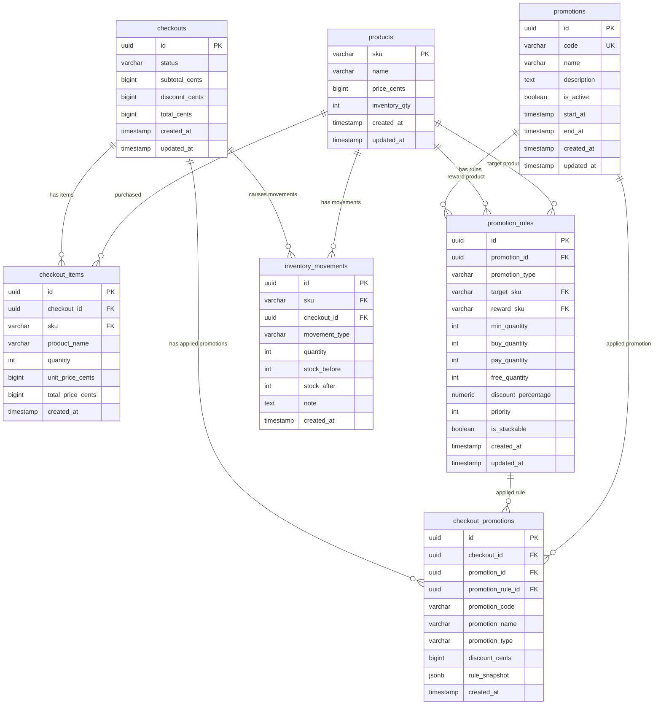

# Database Design Document — IFP Checkout Service

## 1. Overview

This document describes the database design for a checkout backend service.

The service supports:

- Product catalog and inventory.
- Checkout transaction history.
- Checkout item details.
- Configurable promotion rules stored in the database.
- Applied promotion audit trail.
- Inventory movement history.

The promotion system is designed so new promotions can be added from the database as long as they use one of the supported promotion types:

- `FREE_PRODUCT`
- `BUY_X_PAY_Y`
- `PERCENTAGE_DISCOUNT`

The application is still responsible for evaluating promotion rules. The database stores the promotion configuration.

---

## 2. Design Principles

### 2.1 Store money as integer cents

All monetary values are stored as integer cents instead of floating point values.

Examples:

| Amount | Stored Value |
|---:|---:|
| `$49.99` | `4999` |
| `$5,399.99` | `539999` |
| `$109.50` | `10950` |
| `$30.00` | `3000` |

This avoids floating point precision issues.

---

### 2.2 Keep transaction snapshots

Checkout data stores product names, unit prices, totals, and promotion snapshots at the time of checkout.

This is important because product prices and promotion rules can change in the future.

Example:

Today:

```txt
Alexa Speaker discount = 10%
```

Later:

```txt
Alexa Speaker discount = 15%
```

Old checkout history must still show the original discount calculation.

---

### 2.3 Products keep current stock, inventory movements keep history

The `products.inventory_qty` column stores current stock.

The `inventory_movements` table stores stock mutation history.

This provides both fast stock lookup and auditability.

---

## 3. Entity Relationship Diagram



---

## 4. Table Explanation

---

## 4.1 `products`

The `products` table stores product master data and current inventory quantity.

### Responsibilities

- Store SKU, name, and price.
- Store current available stock.
- Become the source of product information during checkout.

### Schema

```sql
CREATE TABLE products (
    sku VARCHAR(50) PRIMARY KEY,
    name VARCHAR(255) NOT NULL,
    price_cents BIGINT NOT NULL CHECK (price_cents >= 0),
    inventory_qty INT NOT NULL CHECK (inventory_qty >= 0),
    created_at TIMESTAMP NOT NULL DEFAULT NOW(),
    updated_at TIMESTAMP NOT NULL DEFAULT NOW()
);
```

### Seed Data

```sql
INSERT INTO products (sku, name, price_cents, inventory_qty)
VALUES
    ('120P90', 'Google Home', 4999, 10),
    ('43N23P', 'MacBook Pro', 539999, 5),
    ('A304SD', 'Alexa Speaker', 10950, 10),
    ('234234', 'Raspberry Pi B', 3000, 2);
```

### Notes

`inventory_qty` is the current stock balance.

When checkout succeeds, this value is decremented inside a database transaction.

---

## 4.2 `promotions`

The `promotions` table stores promotion master data.

### Responsibilities

- Store promotion identity.
- Store promotion display information.
- Control whether a promotion is active.
- Control promotion start and end period.

### Schema

```sql
CREATE TABLE promotions (
    id UUID PRIMARY KEY DEFAULT gen_random_uuid(),
    code VARCHAR(100) NOT NULL UNIQUE,
    name VARCHAR(255) NOT NULL,
    description TEXT,
    is_active BOOLEAN NOT NULL DEFAULT TRUE,
    start_at TIMESTAMP NULL,
    end_at TIMESTAMP NULL,
    created_at TIMESTAMP NOT NULL DEFAULT NOW(),
    updated_at TIMESTAMP NOT NULL DEFAULT NOW()
);
```

### Example Data

```sql
INSERT INTO promotions (code, name, description, is_active)
VALUES
    (
        'MACBOOK_FREE_RASPBERRY',
        'MacBook Pro Free Raspberry Pi B',
        'Each sale of a MacBook Pro comes with a free Raspberry Pi B',
        TRUE
    ),
    (
        'GOOGLE_HOME_BUY_3_PAY_2',
        'Google Home Buy 3 Pay 2',
        'Buy 3 Google Homes for the price of 2',
        TRUE
    ),
    (
        'ALEXA_10_PERCENT_DISCOUNT',
        'Alexa Speaker 10% Discount',
        'Buying Alexa Speakers gets 10% discount',
        TRUE
    );
```

---

## 4.3 `promotion_rules`

The `promotion_rules` table stores configurable promotion rule details.

The application reads these rules and evaluates them using the promotion engine.

### Supported Promotion Types

| Promotion Type | Meaning |
|---|---|
| `FREE_PRODUCT` | Buy a target product and get a reward product for free |
| `BUY_X_PAY_Y` | Buy X quantity and pay only Y quantity |
| `PERCENTAGE_DISCOUNT` | Get percentage discount when minimum quantity is reached |

### Schema

```sql
CREATE TABLE promotion_rules (
    id UUID PRIMARY KEY DEFAULT gen_random_uuid(),
    promotion_id UUID NOT NULL REFERENCES promotions(id) ON DELETE CASCADE,

    promotion_type VARCHAR(50) NOT NULL,

    target_sku VARCHAR(50) NOT NULL REFERENCES products(sku),
    reward_sku VARCHAR(50) NULL REFERENCES products(sku),

    min_quantity INT NULL CHECK (min_quantity IS NULL OR min_quantity > 0),
    buy_quantity INT NULL CHECK (buy_quantity IS NULL OR buy_quantity > 0),
    pay_quantity INT NULL CHECK (pay_quantity IS NULL OR pay_quantity > 0),
    free_quantity INT NULL CHECK (free_quantity IS NULL OR free_quantity > 0),

    discount_percentage NUMERIC(5,2) NULL CHECK (
        discount_percentage IS NULL
        OR discount_percentage BETWEEN 0 AND 100
    ),

    priority INT NOT NULL DEFAULT 100,
    is_stackable BOOLEAN NOT NULL DEFAULT TRUE,

    created_at TIMESTAMP NOT NULL DEFAULT NOW(),
    updated_at TIMESTAMP NOT NULL DEFAULT NOW(),

    CHECK (
        promotion_type IN (
            'FREE_PRODUCT',
            'BUY_X_PAY_Y',
            'PERCENTAGE_DISCOUNT'
        )
    )
);
```

### Why nullable fields?

Each promotion type uses different fields.

Example:

| promotion_type | target_sku | reward_sku | min_quantity | buy_quantity | pay_quantity | free_quantity | discount_percentage |
|---|---|---|---:|---:|---:|---:|---:|
| `FREE_PRODUCT` | `43N23P` | `234234` | 1 | NULL | NULL | 1 | NULL |
| `BUY_X_PAY_Y` | `120P90` | NULL | NULL | 3 | 2 | NULL | NULL |
| `PERCENTAGE_DISCOUNT` | `A304SD` | NULL | 3 | NULL | NULL | NULL | 10.00 |

This approach keeps the schema readable and relational.

For this use case, nullable columns are preferred over `JSONB` because the promotion types are known and limited.

### `priority`

`priority` controls the order of promotion evaluation.

Lower number means higher priority.

Example:

| priority | Meaning |
|---:|---|
| `10` | Evaluated first |
| `20` | Evaluated second |
| `100` | Evaluated last |

This becomes useful when multiple promotions target the same product.

### `is_stackable`

`is_stackable` controls whether a promotion can be combined with other promotions.

Example:

- `true`: can be combined with other promotions.
- `false`: cannot be combined with other promotions.

For the current assignment, promotions are applied to different products, so conflicts are minimal. These fields are included for extensibility.

---

## 4.4 `checkouts`

The `checkouts` table stores the checkout transaction header.

### Responsibilities

- Store checkout status.
- Store subtotal before discount.
- Store total discount.
- Store final total.

### Schema

```sql
CREATE TABLE checkouts (
    id UUID PRIMARY KEY DEFAULT gen_random_uuid(),
    status VARCHAR(50) NOT NULL DEFAULT 'COMPLETED',

    subtotal_cents BIGINT NOT NULL CHECK (subtotal_cents >= 0),
    discount_cents BIGINT NOT NULL CHECK (discount_cents >= 0),
    total_cents BIGINT NOT NULL CHECK (total_cents >= 0),

    created_at TIMESTAMP NOT NULL DEFAULT NOW(),
    updated_at TIMESTAMP NOT NULL DEFAULT NOW(),

    CHECK (
        status IN (
            'COMPLETED',
            'CANCELLED'
        )
    )
);
```

### Field Explanation

| Column | Description |
|---|---|
| `subtotal_cents` | Total price before any promotion |
| `discount_cents` | Total discount from all applied promotions |
| `total_cents` | Final total after discount |

### Formula

```txt
total_cents = subtotal_cents - discount_cents
```

### Example

Cart:

```txt
MacBook Pro x1    = 539999
Raspberry Pi B x1 = 3000
```

Calculation:

```txt
subtotal_cents = 542999
discount_cents = 3000
total_cents    = 539999
```

---

## 4.5 `checkout_items`

The `checkout_items` table stores item-level checkout details.

### Responsibilities

- Store products purchased in checkout.
- Store product snapshot at checkout time.
- Store item quantity and price.

### Schema

```sql
CREATE TABLE checkout_items (
    id UUID PRIMARY KEY DEFAULT gen_random_uuid(),
    checkout_id UUID NOT NULL REFERENCES checkouts(id) ON DELETE CASCADE,
    sku VARCHAR(50) NOT NULL REFERENCES products(sku),

    product_name VARCHAR(255) NOT NULL,
    quantity INT NOT NULL CHECK (quantity > 0),
    unit_price_cents BIGINT NOT NULL CHECK (unit_price_cents >= 0),
    total_price_cents BIGINT NOT NULL CHECK (total_price_cents >= 0),

    created_at TIMESTAMP NOT NULL DEFAULT NOW()
);
```

### Why store `product_name` and `unit_price_cents`?

They are stored as a transaction snapshot.

If the product name or price changes later, old checkout data remains correct.

Example:

Current product:

```txt
SKU 43N23P = MacBook Pro
Price = 539999
```

Later product update:

```txt
SKU 43N23P = MacBook Pro M4
Price = 599999
```

Old checkout history should still show the old name and old price.

---

## 4.6 `checkout_promotions`

The `checkout_promotions` table stores promotions that were applied during checkout.

### Responsibilities

- Store promotion discount breakdown.
- Store applied promotion references.
- Store promotion rule snapshot.
- Protect checkout history from future promotion rule changes.

### Schema

```sql
CREATE TABLE checkout_promotions (
    id UUID PRIMARY KEY DEFAULT gen_random_uuid(),
    checkout_id UUID NOT NULL REFERENCES checkouts(id) ON DELETE CASCADE,

    promotion_id UUID NULL REFERENCES promotions(id),
    promotion_rule_id UUID NULL REFERENCES promotion_rules(id),

    promotion_code VARCHAR(100) NOT NULL,
    promotion_name VARCHAR(255) NOT NULL,
    promotion_type VARCHAR(50) NOT NULL,

    discount_cents BIGINT NOT NULL CHECK (discount_cents >= 0),

    rule_snapshot JSONB NOT NULL,

    created_at TIMESTAMP NOT NULL DEFAULT NOW()
);
```

### Why store `rule_snapshot`?

Promotion rules can change in the future.

If checkout only stores `promotion_rule_id`, old checkout history could become confusing after the rule is updated.

Example:

At checkout time:

```txt
Alexa discount = 10%
min_quantity = 3
```

Later:

```txt
Alexa discount = 15%
min_quantity = 4
```

The old checkout must still keep the 10% rule snapshot.

### Example `rule_snapshot`

For `FREE_PRODUCT`:

```json
{
  "promotion_type": "FREE_PRODUCT",
  "target_sku": "43N23P",
  "target_product_name": "MacBook Pro",
  "reward_sku": "234234",
  "reward_product_name": "Raspberry Pi B",
  "min_quantity": 1,
  "free_quantity": 1,
  "reward_unit_price_cents": 3000
}
```

For `BUY_X_PAY_Y`:

```json
{
  "promotion_type": "BUY_X_PAY_Y",
  "target_sku": "120P90",
  "target_product_name": "Google Home",
  "buy_quantity": 3,
  "pay_quantity": 2,
  "unit_price_cents": 4999
}
```

For `PERCENTAGE_DISCOUNT`:

```json
{
  "promotion_type": "PERCENTAGE_DISCOUNT",
  "target_sku": "A304SD",
  "target_product_name": "Alexa Speaker",
  "min_quantity": 3,
  "discount_percentage": 10.00,
  "unit_price_cents": 10950
}
```

---

## 4.7 `inventory_movements`

The `inventory_movements` table stores stock mutation history.

### Responsibilities

- Track stock changes.
- Provide audit trail for inventory.
- Link checkout stock deduction to checkout transaction.

### Schema

```sql
CREATE TABLE inventory_movements (
    id UUID PRIMARY KEY DEFAULT gen_random_uuid(),

    sku VARCHAR(50) NOT NULL REFERENCES products(sku),
    checkout_id UUID NULL REFERENCES checkouts(id),

    movement_type VARCHAR(50) NOT NULL,
    quantity INT NOT NULL,

    stock_before INT NOT NULL,
    stock_after INT NOT NULL,

    note TEXT NULL,

    created_at TIMESTAMP NOT NULL DEFAULT NOW(),

    CHECK (
        movement_type IN (
            'INITIAL_STOCK',
            'CHECKOUT_DEDUCT',
            'RESTOCK',
            'ADJUSTMENT',
            'CANCEL_RESTORE'
        )
    )
);
```

### Movement Type Explanation

| movement_type | Description |
|---|---|
| `INITIAL_STOCK` | Initial seed stock |
| `CHECKOUT_DEDUCT` | Stock deducted because checkout succeeded |
| `RESTOCK` | Stock increased from restock |
| `ADJUSTMENT` | Manual stock adjustment |
| `CANCEL_RESTORE` | Stock restored because checkout was cancelled |

### Example

Before checkout:

```txt
Google Home stock = 10
```

Checkout:

```txt
Google Home quantity = 3
```

After checkout:

```txt
Google Home stock = 7
```

Inventory movement:

```txt
sku = 120P90
movement_type = CHECKOUT_DEDUCT
quantity = -3
stock_before = 10
stock_after = 7
```

---

## 5. Final PostgreSQL Schema

```sql
CREATE EXTENSION IF NOT EXISTS "pgcrypto";

CREATE TABLE products (
    sku VARCHAR(50) PRIMARY KEY,
    name VARCHAR(255) NOT NULL,
    price_cents BIGINT NOT NULL CHECK (price_cents >= 0),
    inventory_qty INT NOT NULL CHECK (inventory_qty >= 0),
    created_at TIMESTAMP NOT NULL DEFAULT NOW(),
    updated_at TIMESTAMP NOT NULL DEFAULT NOW()
);

CREATE TABLE promotions (
    id UUID PRIMARY KEY DEFAULT gen_random_uuid(),
    code VARCHAR(100) NOT NULL UNIQUE,
    name VARCHAR(255) NOT NULL,
    description TEXT,
    is_active BOOLEAN NOT NULL DEFAULT TRUE,
    start_at TIMESTAMP NULL,
    end_at TIMESTAMP NULL,
    created_at TIMESTAMP NOT NULL DEFAULT NOW(),
    updated_at TIMESTAMP NOT NULL DEFAULT NOW()
);

CREATE TABLE promotion_rules (
    id UUID PRIMARY KEY DEFAULT gen_random_uuid(),
    promotion_id UUID NOT NULL REFERENCES promotions(id) ON DELETE CASCADE,

    promotion_type VARCHAR(50) NOT NULL,

    target_sku VARCHAR(50) NOT NULL REFERENCES products(sku),
    reward_sku VARCHAR(50) NULL REFERENCES products(sku),

    min_quantity INT NULL CHECK (min_quantity IS NULL OR min_quantity > 0),
    buy_quantity INT NULL CHECK (buy_quantity IS NULL OR buy_quantity > 0),
    pay_quantity INT NULL CHECK (pay_quantity IS NULL OR pay_quantity > 0),
    free_quantity INT NULL CHECK (free_quantity IS NULL OR free_quantity > 0),

    discount_percentage NUMERIC(5,2) NULL CHECK (
        discount_percentage IS NULL
        OR discount_percentage BETWEEN 0 AND 100
    ),

    priority INT NOT NULL DEFAULT 100,
    is_stackable BOOLEAN NOT NULL DEFAULT TRUE,

    created_at TIMESTAMP NOT NULL DEFAULT NOW(),
    updated_at TIMESTAMP NOT NULL DEFAULT NOW(),

    CHECK (
        promotion_type IN (
            'FREE_PRODUCT',
            'BUY_X_PAY_Y',
            'PERCENTAGE_DISCOUNT'
        )
    )
);

CREATE TABLE checkouts (
    id UUID PRIMARY KEY DEFAULT gen_random_uuid(),
    status VARCHAR(50) NOT NULL DEFAULT 'COMPLETED',

    subtotal_cents BIGINT NOT NULL CHECK (subtotal_cents >= 0),
    discount_cents BIGINT NOT NULL CHECK (discount_cents >= 0),
    total_cents BIGINT NOT NULL CHECK (total_cents >= 0),

    created_at TIMESTAMP NOT NULL DEFAULT NOW(),
    updated_at TIMESTAMP NOT NULL DEFAULT NOW(),

    CHECK (
        status IN (
            'COMPLETED',
            'CANCELLED'
        )
    )
);

CREATE TABLE checkout_items (
    id UUID PRIMARY KEY DEFAULT gen_random_uuid(),
    checkout_id UUID NOT NULL REFERENCES checkouts(id) ON DELETE CASCADE,
    sku VARCHAR(50) NOT NULL REFERENCES products(sku),

    product_name VARCHAR(255) NOT NULL,
    quantity INT NOT NULL CHECK (quantity > 0),
    unit_price_cents BIGINT NOT NULL CHECK (unit_price_cents >= 0),
    total_price_cents BIGINT NOT NULL CHECK (total_price_cents >= 0),

    created_at TIMESTAMP NOT NULL DEFAULT NOW()
);

CREATE TABLE checkout_promotions (
    id UUID PRIMARY KEY DEFAULT gen_random_uuid(),
    checkout_id UUID NOT NULL REFERENCES checkouts(id) ON DELETE CASCADE,

    promotion_id UUID NULL REFERENCES promotions(id),
    promotion_rule_id UUID NULL REFERENCES promotion_rules(id),

    promotion_code VARCHAR(100) NOT NULL,
    promotion_name VARCHAR(255) NOT NULL,
    promotion_type VARCHAR(50) NOT NULL,

    discount_cents BIGINT NOT NULL CHECK (discount_cents >= 0),

    rule_snapshot JSONB NOT NULL,

    created_at TIMESTAMP NOT NULL DEFAULT NOW()
);

CREATE TABLE inventory_movements (
    id UUID PRIMARY KEY DEFAULT gen_random_uuid(),

    sku VARCHAR(50) NOT NULL REFERENCES products(sku),
    checkout_id UUID NULL REFERENCES checkouts(id),

    movement_type VARCHAR(50) NOT NULL,
    quantity INT NOT NULL,

    stock_before INT NOT NULL,
    stock_after INT NOT NULL,

    note TEXT NULL,

    created_at TIMESTAMP NOT NULL DEFAULT NOW(),

    CHECK (
        movement_type IN (
            'INITIAL_STOCK',
            'CHECKOUT_DEDUCT',
            'RESTOCK',
            'ADJUSTMENT',
            'CANCEL_RESTORE'
        )
    )
);
```

---

## 6. Indexes

```sql
CREATE INDEX idx_promotions_code
ON promotions(code);

CREATE INDEX idx_promotions_active_period
ON promotions(is_active, start_at, end_at);

CREATE INDEX idx_promotion_rules_promotion_id
ON promotion_rules(promotion_id);

CREATE INDEX idx_promotion_rules_target_sku
ON promotion_rules(target_sku);

CREATE INDEX idx_promotion_rules_reward_sku
ON promotion_rules(reward_sku);

CREATE INDEX idx_promotion_rules_type
ON promotion_rules(promotion_type);

CREATE INDEX idx_checkout_items_checkout_id
ON checkout_items(checkout_id);

CREATE INDEX idx_checkout_items_sku
ON checkout_items(sku);

CREATE INDEX idx_checkout_promotions_checkout_id
ON checkout_promotions(checkout_id);

CREATE INDEX idx_checkout_promotions_promotion_id
ON checkout_promotions(promotion_id);

CREATE INDEX idx_checkout_promotions_promotion_rule_id
ON checkout_promotions(promotion_rule_id);

CREATE INDEX idx_inventory_movements_sku
ON inventory_movements(sku);

CREATE INDEX idx_inventory_movements_checkout_id
ON inventory_movements(checkout_id);

CREATE INDEX idx_inventory_movements_movement_type
ON inventory_movements(movement_type);
```

---

## 7. Seed Promotion Rules

### 7.1 MacBook Pro Free Raspberry Pi B

```sql
INSERT INTO promotion_rules (
    promotion_id,
    promotion_type,
    target_sku,
    reward_sku,
    min_quantity,
    free_quantity,
    priority,
    is_stackable
)
SELECT
    id,
    'FREE_PRODUCT',
    '43N23P',
    '234234',
    1,
    1,
    10,
    TRUE
FROM promotions
WHERE code = 'MACBOOK_FREE_RASPBERRY';
```

### 7.2 Google Home Buy 3 Pay 2

```sql
INSERT INTO promotion_rules (
    promotion_id,
    promotion_type,
    target_sku,
    buy_quantity,
    pay_quantity,
    priority,
    is_stackable
)
SELECT
    id,
    'BUY_X_PAY_Y',
    '120P90',
    3,
    2,
    20,
    TRUE
FROM promotions
WHERE code = 'GOOGLE_HOME_BUY_3_PAY_2';
```

### 7.3 Alexa Speaker 10% Discount

The requirement says the discount applies when buying more than 3 Alexa Speakers. However, the sample scenario applies the discount for exactly 3 Alexa Speakers.

To match the sample output, this rule uses `min_quantity = 3`.

```sql
INSERT INTO promotion_rules (
    promotion_id,
    promotion_type,
    target_sku,
    min_quantity,
    discount_percentage,
    priority,
    is_stackable
)
SELECT
    id,
    'PERCENTAGE_DISCOUNT',
    'A304SD',
    3,
    10.00,
    30,
    TRUE
FROM promotions
WHERE code = 'ALEXA_10_PERCENT_DISCOUNT';
```

---

## 8. Checkout Transaction Flow

Checkout must be executed inside a database transaction.

Recommended flow:

```txt
1. Begin transaction.
2. Lock selected product rows using SELECT FOR UPDATE.
3. Validate requested quantity against products.inventory_qty.
4. Build checkout items.
5. Calculate subtotal.
6. Load active promotion rules.
7. Apply promotion engine.
8. Calculate discount and total.
9. Insert checkouts.
10. Insert checkout_items.
11. Insert checkout_promotions with rule_snapshot.
12. Update products.inventory_qty.
13. Insert inventory_movements.
14. Commit transaction.
```

### Example stock lock query

```sql
SELECT *
FROM products
WHERE sku = ANY($1)
FOR UPDATE;
```

### Example stock deduction

```sql
UPDATE products
SET inventory_qty = inventory_qty - $1,
    updated_at = NOW()
WHERE sku = $2;
```

---

## 9. Active Promotion Query

```sql
SELECT
    p.id AS promotion_id,
    p.code,
    p.name,
    p.description,
    pr.id AS promotion_rule_id,
    pr.promotion_type,
    pr.target_sku,
    pr.reward_sku,
    pr.min_quantity,
    pr.buy_quantity,
    pr.pay_quantity,
    pr.free_quantity,
    pr.discount_percentage,
    pr.priority,
    pr.is_stackable
FROM promotions p
JOIN promotion_rules pr ON pr.promotion_id = p.id
WHERE p.is_active = TRUE
  AND (p.start_at IS NULL OR p.start_at <= NOW())
  AND (p.end_at IS NULL OR p.end_at >= NOW())
ORDER BY pr.priority ASC;
```

---

## 10. Summary

Final tables:

```txt
products
promotions
promotion_rules
checkouts
checkout_items
checkout_promotions
inventory_movements
```

Responsibility summary:

| Table | Responsibility |
|---|---|
| `products` | Product master data and current stock |
| `promotions` | Promotion master/header |
| `promotion_rules` | Configurable promotion rules |
| `checkouts` | Checkout transaction summary |
| `checkout_items` | Checkout item details and product snapshot |
| `checkout_promotions` | Applied promotion breakdown and rule snapshot |
| `inventory_movements` | Inventory mutation audit trail |

This design balances simplicity and extensibility. It is suitable for a take-home backend test while still showing production-oriented thinking around transaction history, rule changes, and inventory auditability.
