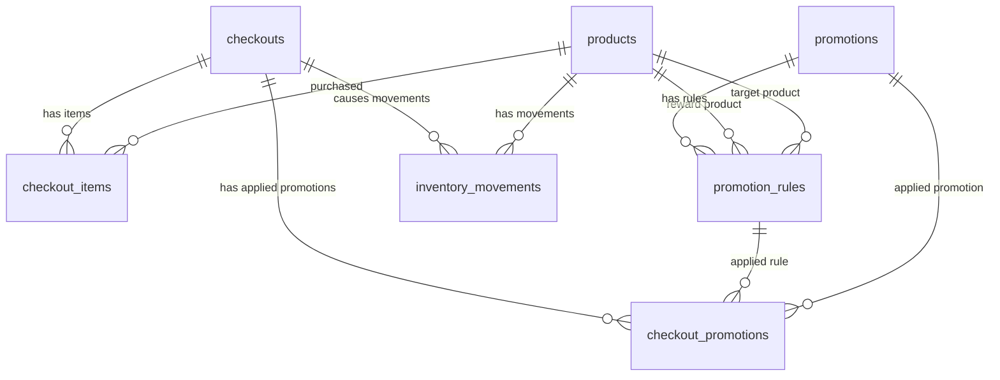

# Product Requirement Document (PRD) — IFP Checkout Service

## 1. Document Information

| Item | Description |
|---|---|
| Product Name | IFP Checkout Service |
| Document Type | Product Requirement Document |
| Target Users | Backend engineer reviewer, API consumers, internal engineering team |
| Main Objective | Build a checkout backend service that calculates total price based on product inventory and configurable promotion rules |
| Recommended Project Name | `ifp-checkout-service` |
| Recommended Tech Stack | Golang, PostgreSQL, Docker, Docker Compose, GitHub Actions |

---

## 2. Background

The system is a backend checkout service for an online shopping scenario.

The service must support a predefined product inventory and several promotions:

1. Each sale of a MacBook Pro comes with a free Raspberry Pi B.
2. Buy 3 Google Homes for the price of 2.
3. Buying Alexa Speakers gets a 10% discount depending on the configured minimum quantity.

The implementation should prioritize clean software design, code readability, proper abstractions, testability, Docker support, database design, and CI readiness.

---

## 3. Goals

The main goals are:

1. Provide an API to list available products.
2. Provide an API to perform checkout.
3. Validate product availability before checkout.
4. Calculate subtotal, discount, and final total.
5. Support promotion rules that are configurable from the database.
6. Save checkout transaction history.
7. Save applied promotion history.
8. Save promotion rule snapshot at checkout time.
9. Deduct inventory after successful checkout.
10. Record inventory movement history.
11. Provide automated tests for checkout and promotion scenarios.
12. Provide Docker and Docker Compose setup.
13. Provide database design documentation.
14. Provide CI configuration as a plus point.

---

## 4. Non-Goals

The following are outside the scope of this take-home test:

1. User authentication.
2. Payment gateway integration.
3. Shipping calculation.
4. Tax calculation.
5. Admin dashboard.
6. Multi-currency support.
7. Product category management.
8. Complex customer segmentation.
9. Voucher code redemption.
10. Distributed inventory across multiple warehouses.

---

## 5. Product Inventory

Initial product data:

| SKU | Product Name | Price | Price in Cents | Initial Stock |
|---|---|---:|---:|---:|
| `120P90` | Google Home | `$49.99` | `4999` | `10` |
| `43N23P` | MacBook Pro | `$5,399.99` | `539999` | `5` |
| `A304SD` | Alexa Speaker | `$109.50` | `10950` | `10` |
| `234234` | Raspberry Pi B | `$30.00` | `3000` | `2` |

Money must be stored as integer cents to avoid floating point precision issues.

---

## 6. Promotion Requirements

## 6.1 MacBook Pro Free Raspberry Pi B

### Rule

Each sale of a MacBook Pro comes with a free Raspberry Pi B.

### Example

Input:

```txt
MacBook Pro x1
Raspberry Pi B x1
```

Calculation:

```txt
MacBook Pro     = 539999
Raspberry Pi B  = 3000
Subtotal        = 542999
Discount        = 3000
Total           = 539999
```

### Rule Type

```txt
FREE_PRODUCT
```

### Rule Configuration

```txt
target_sku = 43N23P
reward_sku = 234234
min_quantity = 1
free_quantity = 1
```

---

## 6.2 Google Home Buy 3 Pay 2

### Rule

Buy 3 Google Homes for the price of 2.

### Example

Input:

```txt
Google Home x3
```

Calculation:

```txt
Subtotal = 3 x 4999 = 14997
Discount = 1 x 4999 = 4999
Total    = 9998
```

### Rule Type

```txt
BUY_X_PAY_Y
```

### Rule Configuration

```txt
target_sku = 120P90
buy_quantity = 3
pay_quantity = 2
```

---

## 6.3 Alexa Speaker Percentage Discount

### Rule

Buying Alexa Speakers gets a 10% discount based on configured minimum quantity.

### Requirement Ambiguity

The requirement text says the discount applies when buying more than 3 Alexa Speakers.

However, the sample scenario applies the discount for exactly 3 Alexa Speakers.

To match the sample output, the default configuration uses:

```txt
min_quantity = 3
```

If the reviewer expects the literal requirement, this can be changed to:

```txt
min_quantity = 4
```

without changing application code.

### Example

Input:

```txt
Alexa Speaker x3
```

Calculation:

```txt
Subtotal = 3 x 10950 = 32850
Discount = 10% x 32850 = 3285
Total    = 29565
```

### Rule Type

```txt
PERCENTAGE_DISCOUNT
```

### Rule Configuration

```txt
target_sku = A304SD
min_quantity = 3
discount_percentage = 10.00
```

---

## 7. Functional Requirements

## 7.1 Product Listing

The system must provide an endpoint to list products.

### Requirement

The API should return:

- Product UUID
- SKU
- Product name
- Price
- Available inventory quantity

### Endpoint

```txt
GET /api/v1/products
```

---

## 7.2 Checkout

The system must provide an endpoint to checkout products.

### Requirement

The API should:

1. Accept checkout item list.
2. Validate request payload.
3. Validate SKU existence.
4. Validate inventory availability.
5. Calculate subtotal.
6. Load active promotion rules from database.
7. Apply eligible promotion rules.
8. Calculate total discount.
9. Calculate final total.
10. Save checkout transaction.
11. Save checkout items.
12. Save applied promotions.
13. Save promotion rule snapshot.
14. Deduct inventory.
15. Save inventory movements.
16. Return checkout result.

### Endpoint

```txt
POST /api/v1/checkouts
```

---

## 7.3 Checkout History

The system should provide an endpoint to get checkout detail.

### Requirement

The API should return:

- Checkout ID
- Checkout status
- Checkout items
- Subtotal
- Discount
- Total
- Applied promotions
- Created timestamp

### Endpoint

```txt
GET /api/v1/checkouts/{checkout_id}
```

---

## 7.4 Health Check

The system should provide a health check endpoint.

### Endpoint

```txt
GET /health
```

### Response

```json
{
  "status": "ok"
}
```

---

## 8. API Specification

## 8.1 Get Products

### Request

```http
GET /api/v1/products
```

### Query Parameters

| Name | Type | Required | Description |
|---|---|---:|---|
| `page` | integer | No | Page number. Default: `1` |
| `per_page` | integer | No | Items per page. Default: `20` |

### Response

All successful REST responses must use the repository standard response wrapper from `internal/pkg/response`.

```json
{
  "message": "Request Successfully Processed",
  "data": {
    "products": [
      {
        "uuid": "11111111-1111-1111-1111-111111111111",
        "sku": "120P90",
        "name": "Google Home",
        "price_cents": 4999,
        "formatted_price": "$49.99",
        "inventory_qty": 10
      },
      {
        "uuid": "22222222-2222-2222-2222-222222222222",
        "sku": "43N23P",
        "name": "MacBook Pro",
        "price_cents": 539999,
        "formatted_price": "$5,399.99",
        "inventory_qty": 5
      }
    ],
    "pagination": {
      "page": 1,
      "per_page": 20,
      "page_count": 1,
      "total_count": 4
    }
  }
}
```

---

## 8.2 Create Checkout

### Request

```http
POST /api/v1/checkouts
Content-Type: application/json
```

### Request Body

```json
{
  "items": [
    {
      "sku": "43N23P",
      "quantity": 1
    },
    {
      "sku": "234234",
      "quantity": 1
    }
  ]
}
```

### Success Response

```json
{
  "message": "Request Successfully Processed",
  "data": {
    "checkout_id": "5b1a50f7-91d1-465d-a31e-c0ec1f1a4c99",
    "status": "COMPLETED",
    "items": [
      {
        "sku": "43N23P",
        "name": "MacBook Pro",
        "quantity": 1,
        "unit_price_cents": 539999,
        "total_price_cents": 539999
      },
      {
        "sku": "234234",
        "name": "Raspberry Pi B",
        "quantity": 1,
        "unit_price_cents": 3000,
        "total_price_cents": 3000
      }
    ],
    "subtotal_cents": 542999,
    "discount_cents": 3000,
    "total_cents": 539999,
    "formatted_total": "$5,399.99",
    "applied_promotions": [
      {
        "promotion_code": "MACBOOK_FREE_RASPBERRY",
        "promotion_name": "MacBook Pro Free Raspberry Pi B",
        "promotion_type": "FREE_PRODUCT",
        "discount_cents": 3000
      }
    ]
  }
}
```

---

## 8.3 Get Checkout Detail

### Request

```http
GET /api/v1/checkouts/{checkout_id}
```

### Response

```json
{
  "message": "Request Successfully Processed",
  "data": {
    "checkout_id": "5b1a50f7-91d1-465d-a31e-c0ec1f1a4c99",
    "status": "COMPLETED",
    "items": [
      {
        "sku": "43N23P",
        "name": "MacBook Pro",
        "quantity": 1,
        "unit_price_cents": 539999,
        "total_price_cents": 539999
      }
    ],
    "subtotal_cents": 539999,
    "discount_cents": 0,
    "total_cents": 539999,
    "applied_promotions": [],
    "created_at": "2026-06-09T10:00:00Z"
  }
}
```

---

## 9. Error Handling

All API errors should follow a consistent response format.

### Error Response Format

All REST errors must use the repository standard error response from `internal/pkg/response.ErrorResponse` and `internal/app/server/rest/middleware.go`.

```json
{
  "message": "Product Raspberry Pi B only has 2 items available",
  "error_code": "INSUFFICIENT_STOCK"
}
```

### Error Cases

| Case | HTTP Status | Error Code |
|---|---:|---|
| Empty item list | `400` | `INVALID_REQUEST` |
| Quantity less than or equal to zero | `400` | `INVALID_QUANTITY` |
| SKU not found | `404` | `PRODUCT_NOT_FOUND` |
| Insufficient stock | `409` | `INSUFFICIENT_STOCK` |
| Invalid promotion configuration | `500` | `INVALID_PROMOTION_RULE` |
| Database error | `500` | `INTERNAL_SERVER_ERROR` |

---

## 10. Database Design

Final tables:

```txt
products
promotions
promotion_rules
checkouts
checkout_items
checkout_promotions
inventory_movements
```

### Responsibility Summary

| Table | Responsibility |
|---|---|
| `products` | Product master data and current inventory |
| `promotions` | Promotion master/header |
| `promotion_rules` | Configurable promotion rule details |
| `checkouts` | Checkout transaction summary |
| `checkout_items` | Checkout item details |
| `checkout_promotions` | Applied promotion history and rule snapshot |
| `inventory_movements` | Inventory mutation audit trail |

---

## 11. Entity Relationship Diagram



---

## 12. Database Schema

```sql
CREATE EXTENSION IF NOT EXISTS "pgcrypto";

CREATE TABLE products (
    uuid UUID PRIMARY KEY DEFAULT gen_random_uuid(),
    sku VARCHAR(50) NOT NULL UNIQUE,
    name VARCHAR(255) NOT NULL,
    price_cents BIGINT NOT NULL CHECK (price_cents >= 0),
    inventory_qty INT NOT NULL CHECK (inventory_qty >= 0),
    created_at TIMESTAMP NOT NULL DEFAULT NOW(),
    updated_at TIMESTAMP NOT NULL DEFAULT NOW()
);

CREATE TABLE promotions (
    id UUID PRIMARY KEY DEFAULT gen_random_uuid(),
    code VARCHAR(100) NOT NULL UNIQUE,
    name VARCHAR(255) NOT NULL,
    description TEXT,
    is_active BOOLEAN NOT NULL DEFAULT TRUE,
    start_at TIMESTAMP NULL,
    end_at TIMESTAMP NULL,
    created_at TIMESTAMP NOT NULL DEFAULT NOW(),
    updated_at TIMESTAMP NOT NULL DEFAULT NOW()
);

CREATE TABLE promotion_rules (
    id UUID PRIMARY KEY DEFAULT gen_random_uuid(),
    promotion_id UUID NOT NULL REFERENCES promotions(id) ON DELETE CASCADE,

    promotion_type VARCHAR(50) NOT NULL,

    target_sku VARCHAR(50) NOT NULL REFERENCES products(sku),
    reward_sku VARCHAR(50) NULL REFERENCES products(sku),

    min_quantity INT NULL CHECK (min_quantity IS NULL OR min_quantity > 0),
    buy_quantity INT NULL CHECK (buy_quantity IS NULL OR buy_quantity > 0),
    pay_quantity INT NULL CHECK (pay_quantity IS NULL OR pay_quantity > 0),
    free_quantity INT NULL CHECK (free_quantity IS NULL OR free_quantity > 0),

    discount_percentage NUMERIC(5,2) NULL CHECK (
        discount_percentage IS NULL
        OR discount_percentage BETWEEN 0 AND 100
    ),

    priority INT NOT NULL DEFAULT 100,
    is_stackable BOOLEAN NOT NULL DEFAULT TRUE,

    created_at TIMESTAMP NOT NULL DEFAULT NOW(),
    updated_at TIMESTAMP NOT NULL DEFAULT NOW(),

    CHECK (
        promotion_type IN (
            'FREE_PRODUCT',
            'BUY_X_PAY_Y',
            'PERCENTAGE_DISCOUNT'
        )
    )
);

CREATE TABLE checkouts (
    id UUID PRIMARY KEY DEFAULT gen_random_uuid(),
    status VARCHAR(50) NOT NULL DEFAULT 'COMPLETED',

    subtotal_cents BIGINT NOT NULL CHECK (subtotal_cents >= 0),
    discount_cents BIGINT NOT NULL CHECK (discount_cents >= 0),
    total_cents BIGINT NOT NULL CHECK (total_cents >= 0),

    created_at TIMESTAMP NOT NULL DEFAULT NOW(),
    updated_at TIMESTAMP NOT NULL DEFAULT NOW(),

    CHECK (
        status IN (
            'COMPLETED',
            'CANCELLED'
        )
    )
);

CREATE TABLE checkout_items (
    id UUID PRIMARY KEY DEFAULT gen_random_uuid(),
    checkout_id UUID NOT NULL REFERENCES checkouts(id) ON DELETE CASCADE,
    sku VARCHAR(50) NOT NULL REFERENCES products(sku),

    product_name VARCHAR(255) NOT NULL,
    quantity INT NOT NULL CHECK (quantity > 0),
    unit_price_cents BIGINT NOT NULL CHECK (unit_price_cents >= 0),
    total_price_cents BIGINT NOT NULL CHECK (total_price_cents >= 0),

    created_at TIMESTAMP NOT NULL DEFAULT NOW()
);

CREATE TABLE checkout_promotions (
    id UUID PRIMARY KEY DEFAULT gen_random_uuid(),
    checkout_id UUID NOT NULL REFERENCES checkouts(id) ON DELETE CASCADE,

    promotion_id UUID NULL REFERENCES promotions(id),
    promotion_rule_id UUID NULL REFERENCES promotion_rules(id),

    promotion_code VARCHAR(100) NOT NULL,
    promotion_name VARCHAR(255) NOT NULL,
    promotion_type VARCHAR(50) NOT NULL,

    discount_cents BIGINT NOT NULL CHECK (discount_cents >= 0),

    rule_snapshot JSONB NOT NULL,

    created_at TIMESTAMP NOT NULL DEFAULT NOW()
);

CREATE TABLE inventory_movements (
    id UUID PRIMARY KEY DEFAULT gen_random_uuid(),

    sku VARCHAR(50) NOT NULL REFERENCES products(sku),
    checkout_id UUID NULL REFERENCES checkouts(id),

    movement_type VARCHAR(50) NOT NULL,
    quantity INT NOT NULL,

    stock_before INT NOT NULL,
    stock_after INT NOT NULL,

    note TEXT NULL,

    created_at TIMESTAMP NOT NULL DEFAULT NOW(),

    CHECK (
        movement_type IN (
            'INITIAL_STOCK',
            'CHECKOUT_DEDUCT',
            'RESTOCK',
            'ADJUSTMENT',
            'CANCEL_RESTORE'
        )
    )
);
```

---

## 13. Promotion Engine Design

Products use `uuid` as the primary key and `sku` as a unique business identifier. Checkout requests, promotion rules, checkout items, and inventory movements continue to use SKU because SKU is the external product code used by API clients and promotion configuration.

Promotion rules are stored in the database as configuration.

The application contains evaluator logic for each supported promotion type.

### Promotion Types

```txt
FREE_PRODUCT
BUY_X_PAY_Y
PERCENTAGE_DISCOUNT
```

### Promotion Evaluation Flow

```txt
1. Load active promotion rules from database.
2. Sort rules by priority.
3. For each rule:
   - Check promotion type.
   - Check target SKU quantity in cart.
   - Calculate discount.
   - Create applied promotion result.
4. Sum all promotion discounts.
5. Return applied promotion list.
```

### Pseudocode

```go
func ApplyPromotion(cart Cart, rule PromotionRule) AppliedPromotion {
    switch rule.PromotionType {
    case "FREE_PRODUCT":
        return applyFreeProduct(cart, rule)

    case "BUY_X_PAY_Y":
        return applyBuyXPayY(cart, rule)

    case "PERCENTAGE_DISCOUNT":
        return applyPercentageDiscount(cart, rule)

    default:
        return AppliedPromotion{}
    }
}
```

---

## 14. Checkout Transaction Flow

Checkout must be executed inside a database transaction.

```txt
1. Begin transaction.
2. Lock selected product rows using SELECT FOR UPDATE.
3. Validate SKU and requested quantity.
4. Validate inventory availability.
5. Build checkout items.
6. Calculate subtotal.
7. Load active promotion rules.
8. Apply promotion engine.
9. Calculate discount and final total.
10. Insert checkouts.
11. Insert checkout_items.
12. Insert checkout_promotions with rule_snapshot.
13. Update products.inventory_qty.
14. Insert inventory_movements.
15. Commit transaction.
```

### Product Lock Query

```sql
SELECT *
FROM products
WHERE sku = ANY($1)
FOR UPDATE;
```

### Stock Deduction Query

```sql
UPDATE products
SET inventory_qty = inventory_qty - $1,
    updated_at = NOW()
WHERE sku = $2;
```

---

## 15. Inventory Handling

### Current Stock

Current stock is stored in:

```txt
products.inventory_qty
```

### Stock History

Stock history is stored in:

```txt
inventory_movements
```

### Checkout Deduction Example

Before checkout:

```txt
Google Home stock = 10
```

Checkout request:

```txt
Google Home x3
```

After checkout:

```txt
Google Home stock = 7
```

Inventory movement:

```txt
sku = 120P90
movement_type = CHECKOUT_DEDUCT
quantity = -3
stock_before = 10
stock_after = 7
```

---

## 16. Architecture

The implementation must follow the current repository Clean Architecture layout.

```txt
REST / gRPC / Worker Handler
    ↓
Usecase
    ↓
Repository / Wrapper
    ↓
Database / External Service
```

Repository architecture responsibilities:

| Layer | Repository Path | Responsibility |
|---|---|---|
| REST Handler | `internal/app/handler/rest` | HTTP request validation, response mapping, Swagger annotations |
| gRPC Handler | `internal/app/handler/grpc` | gRPC service interface implementation if needed |
| Worker Handler | `internal/app/handler/worker` | Background job handlers if needed |
| Usecase | `internal/app/usecase` | Business flow, checkout orchestration, promotion calculation, inventory validation |
| Repository | `internal/app/repository` | sqlx database operations |
| Entity | `internal/app/entity` | Database/domain entity structs |
| Container | `internal/app/container` | Dependency injection and wiring |
| Server | `internal/app/server` | Router, middleware, REST/gRPC/worker server setup |
| Driver | `internal/app/driver` | PostgreSQL, Redis/Asynq, and other drivers |
| Shared Packages | `internal/pkg` | Response, pagination, validation, error, helper utilities |
| Migration | `migration` | Database schema and seed migrations |

Promotion engine is implemented in the usecase layer and must remain isolated from HTTP handlers.

```txt
Checkout Usecase
    ↓
Promotion Usecase / Promotion Engine
    ↓
Promotion Evaluators
```

All REST responses must use:

- `internal/pkg/response.DefaultResponse`
- `internal/pkg/response.ErrorResponse`
- `internal/pkg/pagination.PaginationResponse` for list APIs

---

## 17. Recommended Folder Structure

The checkout service should be added using the existing repository structure instead of creating separate domain root folders.

```txt
checkout-service/
├── cmd/
│   ├── root.go
│   ├── server.go
│   ├── migrate.go
│   └── server/
│       ├── rest.go
│       ├── grpc.go
│       └── worker.go
│
├── config/
│   └── config.go
│
├── docs/
│   ├── docs.go
│   ├── swagger.json
│   └── swagger.yaml
│
├── internal/
│   ├── app/
│   │   ├── container/
│   │   │   └── container.go
│   │   │
│   │   ├── driver/
│   │   │   ├── postgres.go
│   │   │   └── asynq.go
│   │   │
│   │   ├── entity/
│   │   │   ├── product.go
│   │   │   ├── promotion.go
│   │   │   ├── promotion_rule.go
│   │   │   ├── checkout.go
│   │   │   ├── checkout_item.go
│   │   │   ├── checkout_promotion.go
│   │   │   └── inventory_movement.go
│   │   │
│   │   ├── handler/
│   │   │   ├── rest/
│   │   │   │   ├── product/
│   │   │   │   └── checkout/
│   │   │   ├── grpc/
│   │   │   └── worker/
│   │   │
│   │   ├── repository/
│   │   │   ├── repo_product.go
│   │   │   ├── repo_promotion.go
│   │   │   ├── repo_checkout.go
│   │   │   └── repo_inventory.go
│   │   │
│   │   ├── server/
│   │   │   ├── rest/
│   │   │   │   ├── router.go
│   │   │   │   ├── middleware.go
│   │   │   │   └── server.go
│   │   │   ├── grpc/
│   │   │   └── worker/
│   │   │
│   │   ├── usecase/
│   │   │   ├── product/
│   │   │   ├── checkout/
│   │   │   ├── promotion/
│   │   │   └── inventory/
│   │   │
│   │   └── wrapper/
│   │
│   └── pkg/
│       ├── apperror/
│       ├── constants/
│       ├── pagination/
│       ├── response/
│       └── validator/
│
├── migration/
├── Makefile
├── Dockerfile
├── docker-compose.yml
├── go.mod
└── README.md
```

---

## 18. Testing Requirements

The project should include unit tests and integration tests.

### Unit Tests

Recommended unit tests:

1. MacBook Pro free Raspberry Pi B promotion.
2. Google Home buy 3 pay 2 promotion.
3. Alexa Speaker 10% discount promotion.
4. No promotion scenario.
5. Multiple promotions in one checkout.
6. Invalid SKU.
7. Insufficient stock.
8. Invalid quantity.
9. Inventory deduction after checkout.
10. Promotion rule snapshot saved.

---

## 19. Test Scenarios

## 19.1 MacBook Pro + Raspberry Pi B

Input:

```txt
MacBook Pro x1
Raspberry Pi B x1
```

Expected:

```txt
Subtotal = 542999
Discount = 3000
Total    = 539999
```

---

## 19.2 Google Home x3

Input:

```txt
Google Home x3
```

Expected:

```txt
Subtotal = 14997
Discount = 4999
Total    = 9998
```

---

## 19.3 Alexa Speaker x3

Input:

```txt
Alexa Speaker x3
```

Expected:

```txt
Subtotal = 32850
Discount = 3285
Total    = 29565
```

---

## 19.4 No Promotion

Input:

```txt
Google Home x1
Alexa Speaker x1
```

Expected:

```txt
Subtotal = 4999 + 10950 = 15949
Discount = 0
Total    = 15949
```

---

## 19.5 Multiple Promotions

Input:

```txt
MacBook Pro x1
Raspberry Pi B x1
Google Home x3
Alexa Speaker x3
```

Expected:

```txt
Subtotal = 539999 + 3000 + 14997 + 32850
Subtotal = 590846

Discount = 3000 + 4999 + 3285
Discount = 11284

Total = 579562
```

---

## 20. Non-Functional Requirements

## 20.1 Code Quality

The implementation should:

1. Use clear naming.
2. Separate handler, usecase, repository, and domain logic.
3. Avoid business logic in HTTP handlers.
4. Keep promotion logic testable.
5. Use interfaces where useful.
6. Avoid over-engineering.
7. Return consistent API responses.

---

## 20.2 Reliability

The checkout process should:

1. Use database transactions.
2. Lock product rows during checkout.
3. Prevent negative inventory.
4. Roll back all changes if any step fails.
5. Store transaction snapshots.

---

## 20.3 Maintainability

The system should:

1. Allow new promotions without code changes when using existing promotion types.
2. Keep promotion logic isolated in the promotion engine.
3. Store applied rule snapshot for auditability.
4. Use migrations for database schema changes.
5. Include README and documentation.

---

## 21. Docker Requirement

The project should provide:

1. `Dockerfile`
2. `docker-compose.yml`

Recommended services:

```txt
api
postgres
```

Example Docker Compose services:

```yaml
services:
  api:
    build: .
    ports:
      - "8080:8080"
    depends_on:
      - postgres

  postgres:
    image: postgres:16-alpine
    ports:
      - "5432:5432"
```

---

## 22. CI Requirement

CI is a plus point.

Recommended GitHub Actions steps:

1. Checkout code.
2. Setup Go.
3. Start PostgreSQL service.
4. Run database migration.
5. Run unit tests.
6. Run integration tests.
7. Run linting if configured.

---

## 23. Acceptance Criteria

The implementation is considered complete when:

1. Product list API works.
2. Checkout API works.
3. All three promotions are applied correctly.
4. Checkout result returns subtotal, discount, and total.
5. Product inventory is validated.
6. Product inventory is deducted after successful checkout.
7. Checkout transaction is saved.
8. Checkout items are saved.
9. Applied promotions are saved.
10. Promotion rule snapshots are saved.
11. Inventory movements are saved.
12. Docker setup can run the service.
13. Automated tests are included.
14. Database design document is included.
15. README explains how to run and test the project.
16. All REST success responses use the repository standard `message` and `data` response wrapper.
17. All REST error responses use the repository standard `message` and `error_code` format.
18. All list APIs use the repository standard pagination format with `page`, `per_page`, `page_count`, and `total_count`.

---

## 24. Open Questions

These are the main ambiguities that should be clarified or documented:

1. Should the Alexa Speaker discount apply for quantity `> 3` or `>= 3`?
2. Should the total amount be formatted with exactly 2 decimal places?
3. Should free Raspberry Pi B require available inventory?
4. Should the checkout input be scan-based list of SKU or SKU with quantity?
5. Should checkout immediately deduct inventory or only reserve inventory?

Recommended default decisions:

| Question | Recommended Decision |
|---|---|
| Alexa minimum quantity | Use `min_quantity = 3` to match sample output |
| Money format | Always display 2 decimal places |
| Free item stock | Require available stock for free item if included in checkout |
| Checkout input | Use SKU + quantity |
| Inventory deduction | Deduct inventory when checkout succeeds |

---

## 25. Final Summary

The final design uses:

```txt
Golang backend service
PostgreSQL database
Configurable promotion rules
Promotion engine in application layer
Transaction-safe checkout
Inventory movement audit trail
Dockerized local setup
Automated tests
CI-ready structure
```

This design is simple enough for a take-home test but still demonstrates production-oriented backend engineering practices.
